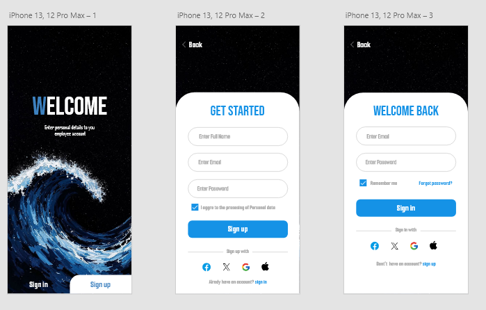
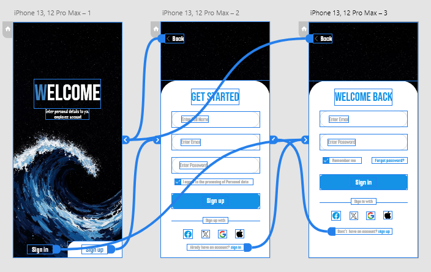

# clean_arch_firebase_user_authentication

A **basic Flutter Firebase authentication app** built using a **feature-based clean architecture pattern**.  
This app demonstrates a scalable and modular project structure ideal for real-world applications.

The concept design was created in **Adobe XD**, and all UI/UX design work was done by myself:

## Installation

1. Clone the repository:  
   `git clone https://github.com/CodeByQafar/flutter_clean_arch_firebase_user_authentication.git`

2. Install dependencies:  
   `dart pub get`

3. Run the application:  
   `flutter run`